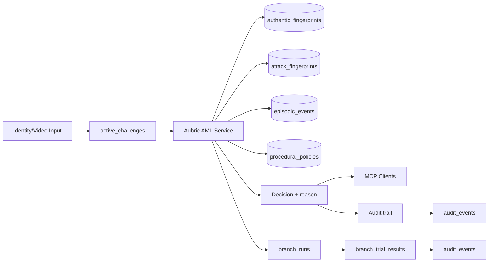

# Aubric AML — Architecture + 3-minute demo script

## System architecture (what judges should see on screen)



## Data plane

1. **Short-term** (`active_challenges`) stores the in-flight authenticity request.
2. **Semantic** (`authentic_fingerprints`, `attack_fingerprints`) stores embeddings for:
   - known-good user signatures
   - known attack signatures
3. **Episodic** (`episodic_events`) stores outcomes, confidence, and eventual truth labels for replay.
4. **Procedural** (`procedural_policies`) stores versioned thresholds/rules used by policy application.

## MCP tool plane

- `aml_authenticity_decide` → returns decision + explainability payload + query latency
- `aml_log_episode` → appends immutable outcome events
- `aml_upsert_authentic_fingerprint` → updates known-good fingerprint state
- `aml_run_update_cycle` → runs replay + adversarial loop on an isolated branch
- `aml_audit_bundle` → exports branch evidence JSON

## End-to-end demo script (48-hour hackathon version)

### Minute 0:00–0:30 — set context
- Open `docs/runbook.md`
- Start the incident scenario runner:

```bash
python scripts/run_demo.py
```

### Minute 0:30–1:15 — baseline authenticity
- Run onboarding phase and show:
  - `decision: allow`
  - low `auth_distance`
  - healthy recent flags/trailing confidence

### Minute 1:15–2:00 — attack escalation
- Run takeover and financial escalation phases in one chain.
- Show the shift to `review`/`deny` as attack signatures light up.

### Minute 2:00–2:45 — learning loop
- Run update cycle:
  - command path is inside `scripts/run_demo.py`
  - print branch id, candidate threshold shifts, simulated metrics, and recommendation

### Minute 2:45–3:00 — compliance evidence close
- Generate artifact:

```bash
cat data/audit_brn-*.json
```

- Show `branch_runs`, `branch_trial_results`, `audit_events` as proof of drift management + versioning.

## Quick checks to state out loud to judges

1. **Track overlap assumption**: TiDB cross-track + Track 2 are stackable. If not, default fallback still demonstrates a robust MCP memory architecture with deterministic fixtures.
2. **TiDB uniqueness**: one-query story and branch/replay evidence loop are visible directly in schema + run output.
3. **Inference path**: stubbed distance scores are deterministic; replace with live Aubric outputs without changing interfaces.
